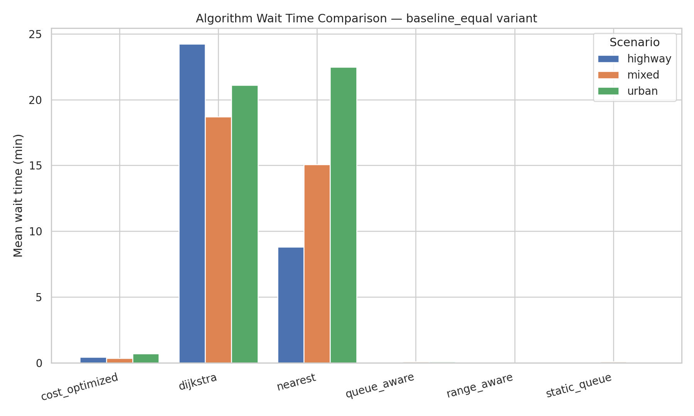
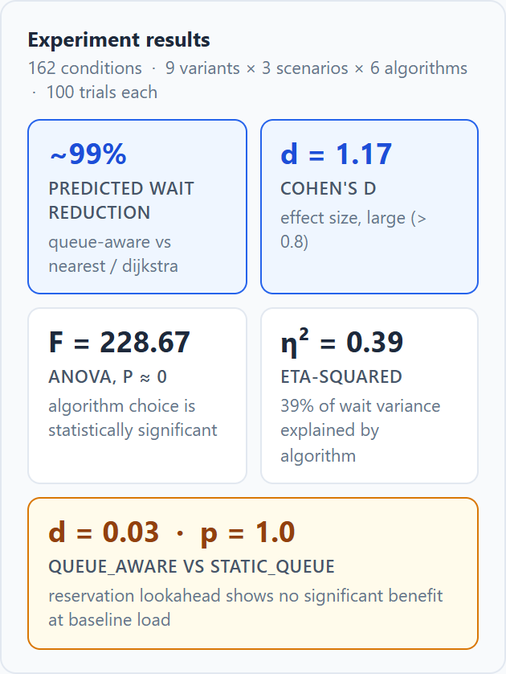
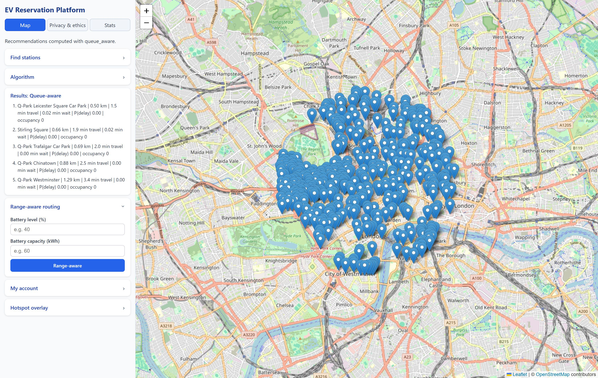

# EV Charger Scheduling

A full-stack system that recommends London EV charging stations, and a controlled experiment
measuring whether it is worth modelling the queue at each one.

Six scheduling strategies compete on the same simulated demand. The finding is that routing people
to the nearest charger, the obvious thing to do, is close to the worst thing you can do.

## The result

Across 300 simulated bookings per algorithm, 100 in each of three scenario profiles (urban, mixed,
highway), with a fixed random seed:

| Algorithm | Mean wait | Mean distance | Bookings accepted |
|---|---|---|---|
| `dijkstra` | 21.3 min | 3.56 km | 66% |
| `nearest` | 15.5 min | 3.38 km | 69% |
| `cost_optimized` | 0.49 min | 3.61 km | 96% |
| `static_queue` | 0.06 min | 3.71 km | 99% |
| `queue_aware` | 0.06 min | 3.83 km | 100% |
| `range_aware` | 0.02 min | 5.83 km | 100% |



Adding a queueing model takes mean wait from roughly 15 to 21 minutes down to under four seconds,
and costs about 300 metres of extra driving. Acceptance rate goes from two thirds to essentially all.

The counterintuitive part is that `dijkstra` is the worst of the six. It computes a genuinely
shorter path than `nearest` does, and it is punished for it: better routing concentrates drivers on
the same few well placed chargers, so they queue. Shortest path is the right answer to the wrong
question. Nothing about the road network tells you how busy the destination is.

Confidence intervals for every cell above are in
[`comparison_table.md`](backend/experiments/outputs/comparison_table.md). The gap between the
queue aware group and the distance only group is far larger than any interval, so the ranking is not
a sampling artefact.

The result that did not go my way is worth stating too. `queue_aware` adds reservation lookahead on
top of `static_queue`, anticipating bookings that will already be in progress when you arrive. At
baseline load it buys nothing: d = 0.03, p = 1.0. The extra machinery only starts to pay under the
`queue_stress` variant. The app reports this alongside the favourable numbers rather than quietly
dropping it.



## Method

The comparison is an experiment rather than a demo, so it is set up to be re-run and checked.

- **Fixed seed.** `run_experiments.py` seeds at 42. Re-running reproduces the table above.
- **Three scenario profiles.** Urban, mixed and highway differ in geographic origin spread and
  session duration, so a result cannot come from one convenient demand pattern.
- **Significance testing.** One-way ANOVA with eta squared for effect size, then pairwise Welch
  t-tests with Bonferroni correction and Cohen's d. Raw output in
  [`anova.txt`](backend/experiments/outputs/anova.txt) and
  [`posthoc_wait.csv`](backend/experiments/outputs/posthoc_wait.csv).
- **Sensitivity analysis.** Distance-priority weighting, a load stress multiplier and top-k
  robustness sampling, in [`sensitivity_summary.csv`](backend/experiments/outputs/sensitivity_summary.csv).
- **Parameter provenance.** The numeric constants in the queueing model are justified against
  published sources in [`docs/parameter_justification.md`](docs/parameter_justification.md), with the
  sensitivity range each one was exercised over. None of them is a number that seemed about right.

One modelling decision worth stating plainly: when utilisation reaches or exceeds 1, the M/M/c
assumptions behind Erlang-C break down and expected wait is unbounded. Rather than let that produce
a misleading finite number, `erlang_c_wait_minutes` returns a capped penalty representing infeasible
congestion. That cap is why the distance-only strategies show low acceptance rates rather than
absurd wait times.

## The six strategies

| Strategy | Optimises for |
|---|---|
| `nearest` | Straight road distance |
| `dijkstra` | Shortest path over a simplified road graph |
| `static_queue` | Distance plus Erlang-C predicted wait |
| `queue_aware` | As above, but counting bookings already made in your arrival window |
| `cost_optimized` | Weighted distance, wait and price |
| `range_aware` | Reachability on current battery, then lowest wait |

## The application



502 stations and 761 chargers ingested from OpenChargeMap, routed with OSRM. Switching strategy
re-ranks in place, and every recommendation carries the numbers behind it, so you can see why a
station was chosen rather than being told to trust it. The Stats tab reads the committed experiment
results directly, which is where the panel above comes from.

## How it is built

FastAPI and Python on the backend, Postgres with PostGIS for spatial queries, OSRM for real road
network routing, React with Leaflet for the map, all orchestrated by Docker Compose. Alembic handles
migrations. Station data is ingested live from the OpenChargeMap API rather than fixtures.

```
backend/
  app/
    algorithms.py           the six strategies
    dijkstra.py             shortest path over the station graph
    queueing.py             Erlang-C
    predictive_queueing.py  arrival-window aware variant
  experiments/              experiment runner, analysis, and committed results
  tests/                    backend test suite
frontend/src/               React and Leaflet UI
```

## Running it

You need Docker Desktop running, and an OpenChargeMap API key (free from
https://openchargemap.org/site/develop/api).

```bash
git clone https://github.com/Arnav274/ev-charger-scheduling.git
cd ev-charger-scheduling
cp .env.example .env      # then put your key in OPENCHARGEMAP_API_KEY
docker compose up --build
```

The first run downloads and processes the London street map for OSRM, which takes 5 to 10 minutes
and about 500 MB. Wait for `Application startup complete`.

Then, in a second terminal, four one-time setup commands:

```bash
docker compose exec backend alembic upgrade head                            # create tables
docker compose exec backend python -m scripts.seed_demo                     # demo user
docker compose exec backend python scripts/ingest_openchargemap.py --live   # real station data
docker compose exec backend python -m scripts.seed_background_reservations  # background load
```

After that, `docker compose up` alone starts it in under a minute.

- App: http://localhost:5173
- API docs: http://localhost:8000/docs
- Demo login: `demo.user@example.com` / `DemoPass123!`

Pick a strategy from the dropdown, and the ranked recommendations update. Click one to book a slot.

## Tests

```bash
docker compose exec backend pytest -q
```

56 backend tests across 9 files, plus a frontend suite under Vitest. The ones worth reading are
`test_erlang_c.py`, which pins the queueing maths, and `test_dijkstra.py`, which covers the path
finding including disconnected graphs and unreachable targets.

Unit tests do not tell you the stack is actually wired together, so there is a separate end to end
check:

```bash
bash scripts/smoke_test.sh
```

Run against a running stack, it verifies the containers, that the committed experiment outputs are
present, the health endpoint, that at least 50 stations loaded, that demo login returns a token,
that the stats endpoint returns all 162 conditions, that OSRM answers a real routing query, that the
frontend serves, and then runs the test suite. It prints a pass or fail line per check.

## Troubleshooting

**Port already in use.** The stack needs 5173, 8000, 5000 and 5433. Postgres is published on 5433
rather than 5432 precisely because a locally installed Postgres usually holds 5432.

**Containers exit immediately.** Docker Desktop is not running.

**Map loads but no stations appear.** The ingest step did not complete. Re-run the four setup
commands above.

## Limitations

These are real, not hedging.

**Demand is simulated, not observed.** Arrival rates are drawn from published DfT and Zapmap figures
rather than measured London charger telemetry, which is not publicly available at the resolution
this needs. The relative ranking of the six strategies is the defensible result. The absolute wait
times are only as good as that arrival rate assumption, which is why it gets its own sensitivity
range in the parameter justification.

**The road graph is simplified.** OSRM gives real routing for travel time, but the Dijkstra strategy
runs over a reduced station-to-station graph rather than the full network, so this is a comparison
of scheduling policy rather than a production routing engine.

**No live occupancy feed.** Predicted wait comes from the queueing model plus reservations held in
this system. A deployment would need real time connector status from the operators, which would
change how much work the prediction is doing.

**Single region.** Everything is fitted to London. Station density elsewhere would shift the
distance and wait trade-off, and the range aware strategy in particular depends on there being a
reachable alternative.
