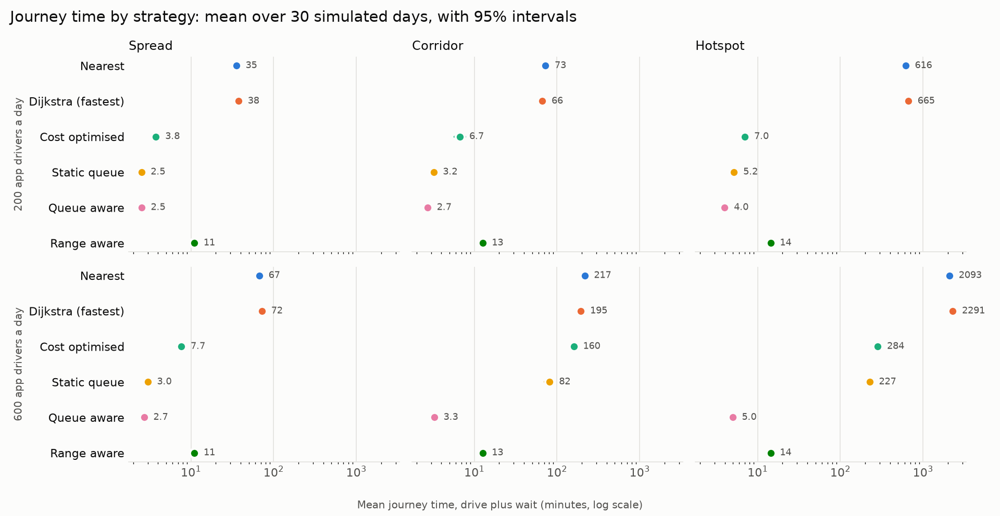
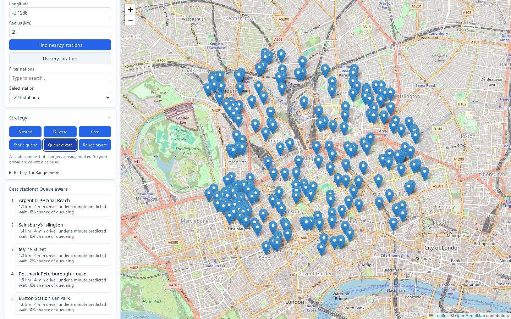
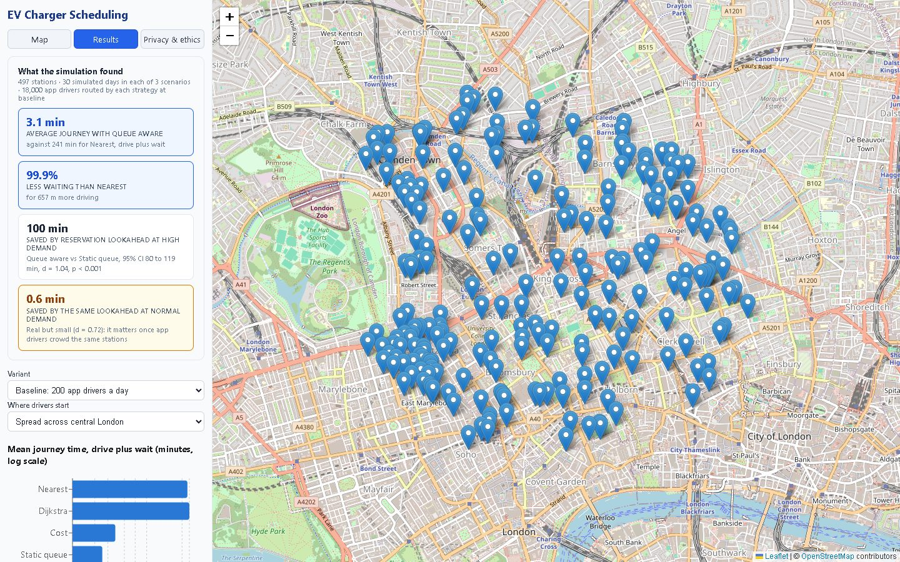

# EV Charger Scheduling

[](https://github.com/Arnav274/ev-charger-scheduling/actions/workflows/ci.yml)

A full-stack app that recommends charging stations in central London, and a simulation experiment
that measures which recommendation strategy actually gets drivers charging soonest.

Six strategies choose stations for the same simulated drivers on the same simulated days. The
drivers then drive there and queue, and the wait is measured, not predicted. Sending people to the
nearest charger is by far the worst option, and predicting queues only keeps working under heavy
demand if the app also counts the bookings it has already handed out.

## The result

Mean journey time (drive plus wait) per app driver, over 30 simulated days in each of three
scenarios, with 200 app drivers a day on top of ordinary background demand:

| Strategy | Where drivers start: spread | corridor | hotspot | At 600 drivers a day, all scenarios |
|---|---|---|---|---|
| `queue_aware` | **2.5 min** | **2.7 min** | **4.0 min** | **3.7 min** |
| `static_queue` | 2.5 | 3.2 | 5.2 | 103.8 |
| `cost_optimized` | 3.8 | 6.7 | 7.0 | 150.5 |
| `range_aware` | 11.0 | 12.6 | 14.4 | 12.7 |
| `nearest` | 35.4 | 72.5 | 616.1 | 792.1 |
| `dijkstra` | 37.7 | 66.5 | 664.7 | 852.8 |



What the numbers say:

- **The closest charger is usually the worst choice.** 407 of the 497 stations in the study area
  have a single charger, many of them lamp posts. Picking the closest one queues you behind whoever
  is already there, and in the hotspot scenario it sends everyone to the same few lamp posts, where
  queues grow all day. Across all scenarios `queue_aware` cuts waiting by 99.9% compared with
  `nearest`, for 657 metres more driving.
- **Queue prediction on its own stops working under load.** `static_queue` predicts each station's
  wait from its charger count, so every driver gets the same answer and is sent to the same hub. At
  200 drivers a day that barely matters. At 600 it herds drivers into queues averaging 101
  minutes. `queue_aware` counts the bookings earlier drivers have already made for their arrival
  window and spreads them out, saving 100 minutes per driver (95% CI 80 to 119, paired
  d<sub>z</sub> = 1.04, Holm-corrected p < 10<sup>-14</sup>).
- **At normal demand the lookahead is worth half a minute.** That saving (0.56 minutes, 95% CI 0.40 to 0.72,
  d<sub>z</sub> = 0.72) is real but small. My dissertation reported no benefit here; its metric could
  not see herding at all (see [below](#from-dissertation-to-this-version)).
- **Fastest route and shortest distance end up in the same place.** `dijkstra` ranks by drive time
  from my own search over the road network, and `nearest` by OSRM road distance. They pick nearly
  the same stations, and the difference between them is not significant (Holm p = 0.11).
- **`range_aware` never queues, but drives furthest.** It picks the shortest predicted wait anywhere
  in range, which sends everyone to the one 34-charger hub on Park Lane, 12 minutes' drive away.

Strategies also affect drivers who never use the app: the distance-only strategies add about 2.4
minutes to their average wait, and the queue-based ones about zero. Every number above is in
[`comparison_table.md`](backend/experiments/outputs/comparison_table.md),
[`summary_ci.csv`](backend/experiments/outputs/summary_ci.csv) and
[`paired_tests.csv`](backend/experiments/outputs/paired_tests.csv).

Two caveats. Simulated drivers never give up and leave a queue, so where a station is overloaded
the very large means show how overloaded it is, not how long anyone would really wait. And every
station is given the same background arrival rate, so the queue model can only tell stations apart
by how many chargers they have. [Limitations](#limitations) has the rest.

## Method

The full design is in [`docs/experiment.md`](docs/experiment.md). In short:

- **Simulation, not prediction.** Each simulated day, background drivers arrive at every station at
  random (Poisson, 0.75 an hour) and charge for an exponentially distributed time (mean 40
  minutes). App drivers set off at random times, ask a strategy where to go, drive the real road
  route and queue first come, first served. The strategies are the same code the API runs.
- **Paired comparisons.** Every strategy faces exactly the same days: the same background arrivals
  and the same app drivers with the same origins and batteries. Days, not drivers, are the unit of
  analysis, compared with paired Wilcoxon and t-tests over 90 (scenario, day) pairs, with Holm
  correction, bootstrap intervals and Cohen's d<sub>z</sub>.
- **Variants.** 200 or 600 app drivers a day, background demand from 0.5 to 2 times the base rate,
  a distance-weighted cost strategy, and drivers taking any of the top three suggestions.
- **Checked against theory.** With only Poisson arrivals and exponential sessions, the simulated
  queue converges on the Erlang-C wait, which a test pins for one, two and four chargers.
- **Reproducible.** The inputs (station snapshot, trip origins, OSRM and Dijkstra travel times) are
  frozen in [`backend/experiments/data`](backend/experiments/data), so the experiment runs offline,
  and re-running it reproduces the outputs byte for byte.
- **Sourced parameters.** Arrival rate, session length and energy use come from published sources,
  in [`docs/parameter_justification.md`](docs/parameter_justification.md).

## The six strategies

| Strategy | Chooses by |
|---|---|
| `nearest` | Shortest road distance, from OSRM |
| `dijkstra` | Fastest drive, from my own Dijkstra search over the London road network |
| `cost_optimized` | Equal weights on distance, predicted wait and price |
| `static_queue` | Mostly Erlang-C predicted wait, a little distance |
| `queue_aware` | As `static_queue`, but chargers already booked for your arrival count as busy |
| `range_aware` | Shortest predicted wait among stations reachable on your current charge |

## Dijkstra on the real road network

`scripts/build_road_graph.py` turns the Greater London OpenStreetMap extract into a directed graph
of 283,000 junctions and 603,000 road segments: car-accessible roads only, one-way streets
respected, and the largest strongly connected component kept so every junction can reach every
other. `app/dijkstra.py` runs a binary-heap Dijkstra over it that stops once every candidate station
is settled. The graph builds in about 20 seconds and a query takes about 145 ms in pure Python.

Compared with OSRM on the same map data over 2,400 routes
([`docs/road_graph_validation.md`](docs/road_graph_validation.md)):

| | Median | 10th percentile | 90th percentile |
|---|---|---|---|
| My distance / OSRM distance | 0.997 | 0.939 | 1.027 |
| My drive time / OSRM drive time | 0.913 | 0.865 | 0.947 |

Both engines pick the same fastest station for 85% of origins, and rank candidates with a median
Spearman correlation of 0.97. My times run lower because the model is free-flow, with no penalty
for turns or traffic lights.

## The application



497 stations and 751 chargers from OpenChargeMap, with OSRM for road routing. Pick a strategy and
the recommendations re-rank, each showing the distance, drive time, predicted wait and chance of
queueing behind it. Click one to book a charger or find the next free slot. The database rules out
double bookings with an exclusion constraint, so two people can't book the same charger for
overlapping times, even at the same instant. The Results tab reads the
experiment's output directly, so the numbers in the app are the ones in this README.



## How it is built

FastAPI and SQLAlchemy on Postgres with PostGIS, OSRM for road routing, React and Leaflet for the
map, Alembic for migrations, all run by Docker Compose. GitHub Actions lints, tests and builds
both halves on every push, with the backend tests running against a real PostGIS database.

```
backend/
  app/
    algorithms.py        the six strategies
    queueing.py          Erlang-C
    dijkstra.py          Dijkstra over the road graph
    recommendation.py    candidate search, reservation lookahead, ranking
    routers/             HTTP endpoints
  experiments/
    simulation.py        the discrete-event simulation
    run_experiments.py   runs every strategy through every simulated day
    analyse_results.py   paired tests, charts and findings.json
    data/                frozen inputs
    outputs/             committed results
  scripts/               ingest, road graph build and validation, seed data
  tests/
frontend/src/
  components/            map, strategy picker, results, booking, account
  hooks/                 auth and station loading
  StatsDashboard.jsx     the Results tab
```

## Running it

You need Docker Desktop and a free OpenChargeMap API key from
https://openchargemap.org/site/develop/api.

```bash
git clone https://github.com/Arnav274/ev-charger-scheduling.git
cd ev-charger-scheduling
cp .env.example .env      # then put your key after OPENCHARGEMAP_API_KEY=
docker compose up --build
```

The first run downloads the Greater London map (about 120 MB) and prepares it for OSRM, which
takes a few minutes. When the backend logs `Application startup complete`, run these once in a
second terminal:

```bash
docker compose exec backend alembic upgrade head                            # create the tables
docker compose exec backend python -m scripts.ingest_openchargemap --live   # load stations
docker compose exec backend python -m scripts.build_road_graph              # graph for Dijkstra
docker compose exec backend python -m scripts.seed_demo                     # demo account
docker compose exec backend python -m scripts.seed_background_reservations  # some existing bookings
```

After that, `docker compose up` on its own starts everything in under a minute.

- App: http://localhost:5173
- API docs: http://localhost:8000/docs
- Demo login: `demo.user@example.com` / `DemoPass123!`

### Re-running the experiment

The experiment needs none of the services, only the committed inputs:

```bash
docker compose run --rm --no-deps backend python -m experiments.run_experiments   # about 11 minutes
docker compose run --rm --no-deps backend python -m experiments.analyse_results
```

`python -m experiments.build_inputs` rebuilds the inputs from the live stack. Station data changes
upstream over time, so the results will then shift slightly.

## Tests

```bash
docker compose exec backend pytest -q     # 168 tests
cd frontend && npm test                   # 16 tests
```

The backend tests run the API against a real PostGIS test database, so the spatial queries and the
double-booking constraint are exercised for real. The ones most worth reading:

- `test_queueing.py` checks Erlang-C against the M/M/1 closed form and a published worked example.
- `test_dijkstra.py` compares the search with SciPy's implementation on random graphs.
- `test_simulation.py` checks that the simulated queue converges on Erlang-C.

For the running stack there is an end-to-end check, which prints a pass or fail line per check:

```bash
bash scripts/smoke_test.sh
```

## Troubleshooting

**Port already in use.** The stack needs 5173, 8000, 5000 and 5433. Postgres is published on 5433
because a locally installed Postgres usually holds 5432.

**Map loads but shows no stations.** The ingest step has not run, or `OPENCHARGEMAP_API_KEY` is
empty. Add the key to `.env`, run `docker compose up -d --force-recreate backend`, then ingest again.

**Dijkstra returns an error.** The road graph has not been built yet; run `scripts.build_road_graph`.

## Limitations

**The demand is simulated.** London does not publish per-charger telemetry at the resolution this
needs, so arrival rates and session lengths come from published averages. The ranking of the
strategies, and how it changes with demand, is the defensible result; the absolute minutes are only
as good as those inputs.

**Every station gets the same arrival rate.** In reality a rapid charger on a main road is far busier
than a lamp post on a side street. With one rate everywhere, the queue model tells stations apart
only by charger count.

**Nobody gives up.** Simulated drivers wait however long it takes. Real drivers would leave a long
queue, which would cap the worst waits and send some of the load elsewhere.

**A small area.** OpenChargeMap returns at most 500 stations per query, so the study area is the 497
stations within about 2.6 km of central London, and all simulated trips start inside it.

**Free-flow driving.** Travel times ignore traffic, for OSRM and my Dijkstra alike.

## From dissertation to this version

This began as my final-year dissertation at the University of East Anglia; the submitted version is
tagged [`dissertation-submission`](https://github.com/Arnav274/ev-charger-scheduling/tree/dissertation-submission).
Coming back to it afterwards, I found problems serious enough to rebuild the experiment:

- It scored each strategy by the Erlang-C wait *predicted* at the station it picked, the same
  formula the queue strategies minimise, so they won by construction and herding could not show up.
  The simulation now measures waits instead.
- Its Dijkstra ran over a complete graph of straight-line distances. Straight-line distance obeys
  the triangle inequality, so the direct edge was always shortest and the search never did
  anything. It now runs over the real road network.
- Most simulated trips started outside the area the station data covered.

The pull requests from [#1](https://github.com/Arnav274/ev-charger-scheduling/pull/1) onwards record
each change and why it was made.

## Data

Station data from [Open Charge Map](https://openchargemap.org) under CC BY 4.0. Map data ©
OpenStreetMap contributors under the ODbL, via [Geofabrik](https://download.geofabrik.de).
